# Overview
Domains covered by the Dataset with image categories and the corresponding [FRLs] in square brackets.
<table>
  <thead>
    <tr>
      <th><strong>Domain</strong></th>
      <th><strong>Image Categories [with FRLs]</strong></th>
    </tr>
  </thead>
  <tbody>
    <tr>
      <td>Electrical &amp; Computer Engineering</td>
      <td>Electrical Circuit [SPICE Netlist, CircuiTikZ]; Digital Hardware Design [Very High Speed Integrated Circuit Hardware Description Language (VHDL), Verilog, Yosys]; Programmable Logic Controller (PLC) [Instruction List]; Quantum Circuit [Open Quantum Assembly Language (OpenQASM) 2, Quirk]; Propositional Logic [Boolean expressions, Logical symbols]</td>
    </tr>
    <tr>
      <td>Computer Science &amp; AI</td>
      <td>Deep Learning Architecture [Open Neural Network Exchange (ONNX) Graph, Keras Configuration, Protocol Buffers (ProtoBuf)]; Graph [GraphML, Graph Modeling Language (GML)]; Knowledge Graph [Resource Description Framework (RDF), Web Ontology Language (OWL), both in XML, Turtle format]</td>
    </tr>
    <tr>
      <td>Software Engineering &amp; System Modeling</td>
      <td>Unified Modeling Language (UML) &amp; Systems Modeling Lang. (SysML): Class Diagram, Sequence Diagram, Activity Diagram, Component Diagram, Use Case Diagram [PlantUML, Mermaid]; State Chart [State Chart XML (SCXML)]; Entity-Relationship (ER) Model [Database Markup Language (DBML), Prisma Schema Language (PSL), Data Definition Language (DDL)]</td>
    </tr>
    <tr>
      <td>Biology</td>
      <td>DNA Sequence [FASTA, Vienna RNA dot-bracket notation]; Phylogenetic Tree [Newick, PhyloXML]; Metabolic Pathway Diagram [Systems Biology Markup Language (SBML), Biological Pathway Exchange (BioPax)]</td>
    </tr>
    <tr>
      <td>Chemistry</td>
      <td>Chemical Structures &amp; Molecules [Simplified Molecular Input Line Entry System (SMILES), SMILES arbitrary target specification (SMARTS), SMARTS Reactions, Protein Data Bank (PDB) format, Chemical Markup Language (CML)]</td>
    </tr>
    <tr>
      <td>Business &amp; Process Management</td>
      <td>Business Process Model [Business Process Model and Notation (BPMN), PlantUML, Mermaid, DOT, D2]; Gantt Diagram [PlantUML, Mermaid]; Mind Map [Mermaid, PlantUML, Markmap]; Charts &amp; Tables [Plotly json]</td>
    </tr>
    <tr>
      <td>Games &amp; Music</td>
      <td>Chess Board [Forsyth-Edwards-Notation (FEN), Portable Game Notation (PGN)]; Musical Notation [ABC, LilyPond, MusicXML]</td>
    </tr>
    <tr>
      <td>Geography</td>
      <td>Geographical map [GeoJSON]</td>
    </tr>
  </tbody>
</table>

# Examples

<table>
  <thead>
    <tr>
      <th>Diagram type &amp; FRL</th>
      <th>Image</th>
      <th>Code</th>
    </tr>
  </thead>
  <tbody>
    <tr>
      <td>Molecular structure FRL: SMILES (Open Babel)</td>
      <td>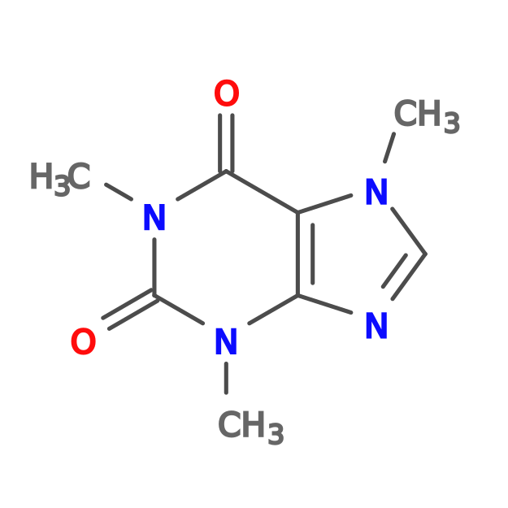</td>
      <td>
        <textarea readonly rows="4" style="width: 100%; height: 120px; font-family: monospace; font-size: 12px;">CN1C=NC2=C1C(=O)N(C(=O)N2C)C</textarea>
      </td>
    </tr>
    <tr>
      <td>RNA secondary structure FRL: Vienna (forgi)</td>
      <td>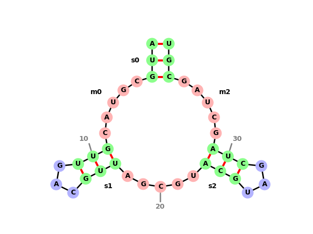</td>
      <td>
        <textarea readonly rows="6" style="width: 100%; height: 160px; font-family: monospace; font-size: 12px;">&gt;synthetic_gene
ATGCGTACGTTGACGTTAGCGTACGTAGCTAGCTAGCGT
(((.....(((...))).....(((...))).....)))</textarea>
      </td>
    </tr>
    <tr>
      <td>Sequence logo FRL: FASTA (logomaker)</td>
      <td>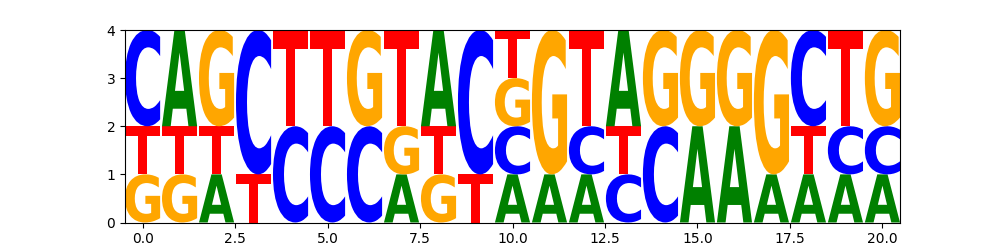</td>
      <td>
        <textarea readonly rows="8" style="width: 100%; height: 180px; font-family: monospace; font-size: 12px;">&gt;CRISPR_TARGET_0001
GAGTCCGAGCAGAAGAAGAAG
&gt;CRISPR_TARGET_0002
TGGCTCGTACGATCGAGGTTG
&gt;CRISPR_TARGET_0003
CTTCTTCTTCTGCTCGGACTC
&gt;CRISPR_TARGET_0004
CAACCTCGATCGTACGAGCCA</textarea>
      </td>
    </tr>
    <tr>
      <td>Phylogenetic tree FRL: Newick</td>
      <td>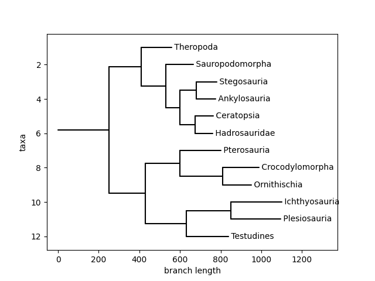</td>
      <td>
        <textarea readonly rows="4" style="width: 100%; height: 120px; font-family: monospace; font-size: 12px;">((Theropoda:150,(Sauropodomorpha:135,((Stegosauria:100,Ankylosauria:95):80,(Ceratopsia:90,Hadrosauridae:85):75):70):120):160,((Pterosauria:200,((Crocodylomorpha:180,Ornithischia:140):110):100):170,((Ichthyosauria:250,Plesiosauria:245):220,Testudines:210):200):180):250;</textarea>
      </td>
    </tr>
    <tr>
      <td>Circuit schematic FRL: SPICE (netlistsvg)</td>
      <td>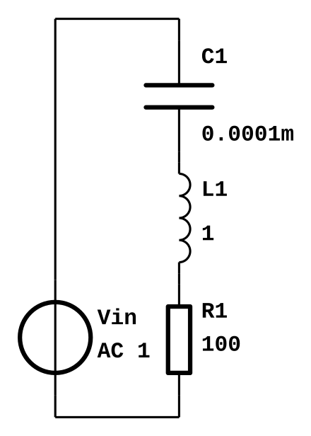</td>
      <td>
        <textarea readonly rows="6" style="width: 100%; height: 150px; font-family: monospace; font-size: 12px;">* Bandpass Filter
Vin 1 0 AC 1
C1 1 2 0.0001m
L1 2 3 1
R1 3 0 100</textarea>
      </td>
    </tr>
    <tr>
      <td>HDL circuit FRL: Verilog (Yosys)</td>
      <td>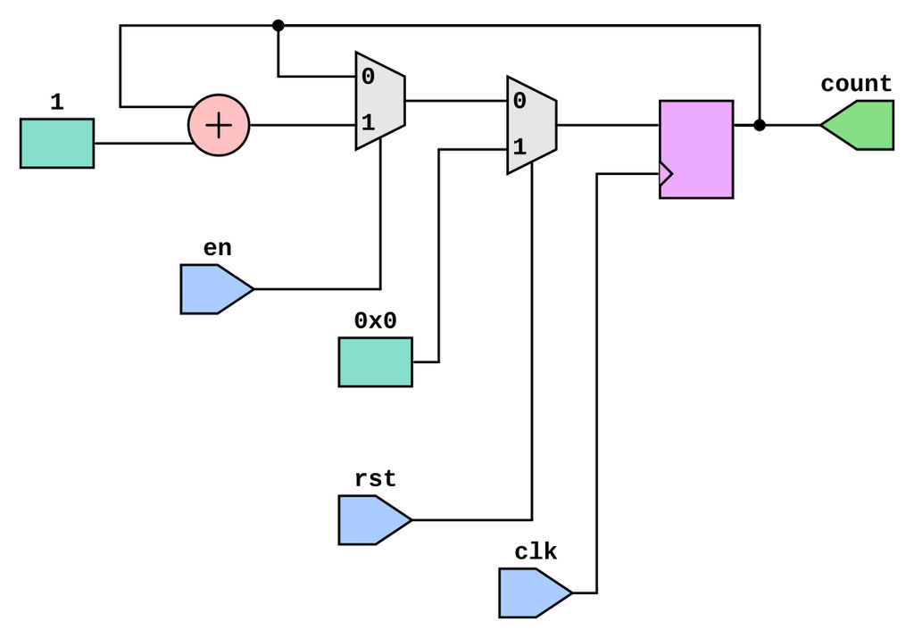</td>
      <td>
        <textarea readonly rows="10" style="width: 100%; height: 180px; font-family: monospace; font-size: 12px;">module up_counter_4bit(
    input clk,
    input rst,
    input en,
    output reg [3:0] count
);
    always @(posedge clk) begin
        if (rst)
            count <= 4'b0000;
        else if (en)
            count <= count + 1;
    end
endmodule</textarea>
      </td>
    </tr>
    <tr>
      <td>Quantum circuit FRL: OpenQASM 2 (Qiskit)</td>
      <td>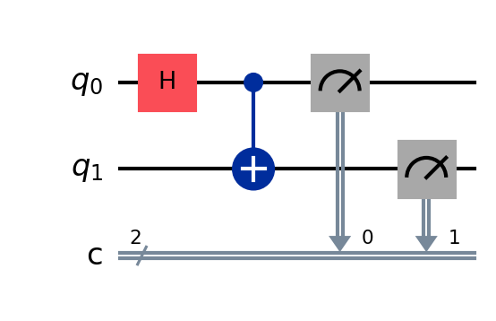</td>
      <td>
        <textarea readonly rows="8" style="width: 100%; height: 160px; font-family: monospace; font-size: 12px;">OPENQASM 2.0;
include "qelib1.inc";
qreg q[2];
creg c[2];
h q[0];
cx q[0],q[1];
measure q[0] -> c[0];
measure q[1] -> c[1];</textarea>
      </td>
    </tr>
    <tr>
      <td>Logic expression FRL: Boolean (schemdraw)</td>
      <td>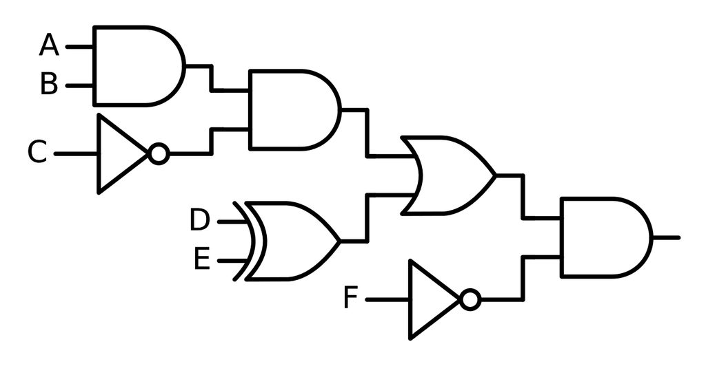</td>
      <td>
        <textarea readonly rows="4" style="width: 100%; height: 120px; font-family: monospace; font-size: 12px;">(((A and B) and (not C)) or (D xor E)) and (not F)</textarea>
      </td>
    </tr>
    <tr>
      <td>Musical notation FRL: ABC (LilyPond)</td>
      <td></td>
      <td>
        <textarea readonly rows="8" style="width: 100%; height: 170px; font-family: monospace; font-size: 12px;">X:1
T:12 Bar Blues in C
M:4/4
L:1/4
K:C
| C E G A | C E G A | C E G A | C E G A |
| F A C D | F A C D | C E G A | C E G A |
| G B D E | F A C D | C E G A | G B D E |</textarea>
      </td>
    </tr>
    <tr>
      <td>Chess position FRL: FEN</td>
      <td>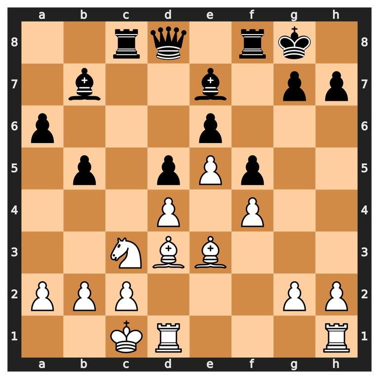</td>
      <td>
        <textarea readonly rows="4" style="width: 100%; height: 120px; font-family: monospace; font-size: 12px;">2rq1rk1/1b2b1pp/p3p3/1p1pPp2/3P1P2/2NBB3/PPP3PP/2KR3R w - - 0 1</textarea>
      </td>
    </tr>
    <tr>
      <td>Activity diagram FRL: Mermaid</td>
      <td>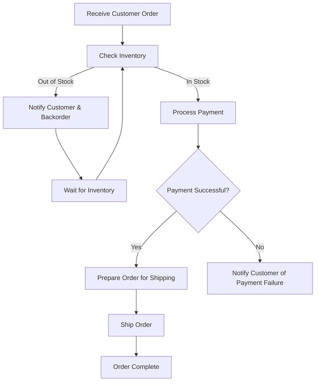</td>
      <td>
        <textarea readonly rows="12" style="width: 100%; height: 220px; font-family: monospace; font-size: 12px;">flowchart TD
    A[Receive Customer Order] --> B[Check Inventory]
    B -->|In Stock| C[Process Payment]
    B -->|Out of Stock| D[Notify Customer &amp; Backorder]
    D --> E[Wait for Inventory]
    E --> B
    C --> F{Payment Successful?}
    F -->|Yes| G[Prepare Order for Shipping]
    F -->|No| H[Notify Customer of Payment Failure]
    G --> I[Ship Order]
    I --> J[Order Complete]</textarea>
      </td>
    </tr>
    <tr>
      <td>Database schema FRL: DBML</td>
      <td>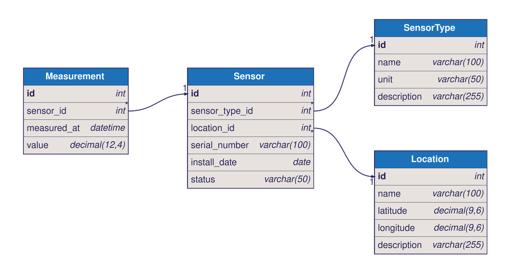</td>
      <td>
        <textarea readonly rows="10" style="width: 100%; height: 200px; font-family: monospace; font-size: 12px;">Table SensorType {
    id int [pk, increment]
    name varchar(100)
    unit varchar(50)
    description varchar(255)
}

Table Location {
    id int [pk, increment]
    name varchar(100)
    latitude decimal(9,6)
    longitude decimal(9,6)
    description varchar(255)
}

Table Sensor {
    id int [pk, increment]
    sensor_type_id int [ref: &gt; SensorType.id]
    location_id int [ref: &gt; Location.id]
    serial_number varchar(100)
    install_date date
    status varchar(50)
}

Table Measurement {
    id int [pk, increment]
    sensor_id int [ref: &gt; Sensor.id]
    measured_at datetime
    value decimal(12,4)
}</textarea>
      </td>
    </tr>
    <tr>
      <td>Class diagram FRL: PlantUML</td>
      <td>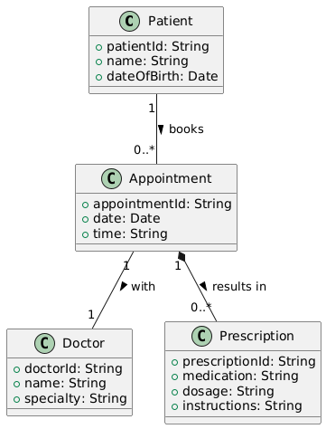</td>
      <td>
        <textarea readonly rows="12" style="width: 100%; height: 220px; font-family: monospace; font-size: 12px;">@startuml class_44_4_1

class Patient {
    +patientId: String
    +name: String
    +dateOfBirth: Date
}

class Doctor {
    +doctorId: String
    +name: String
    +specialty: String
}

class Appointment {
    +appointmentId: String
    +date: Date
    +time: String
}

class Prescription {
    +prescriptionId: String
    +medication: String
    +dosage: String
    +instructions: String
}

Patient "1" -- "0..*" Appointment : books >
Appointment "1" -- "1" Doctor : with >
Appointment "1" *-- "0..*" Prescription : results in >

@enduml</textarea>
      </td>
    </tr>
    <tr>
      <td>Sequence diagram FRL: PlantUML</td>
      <td>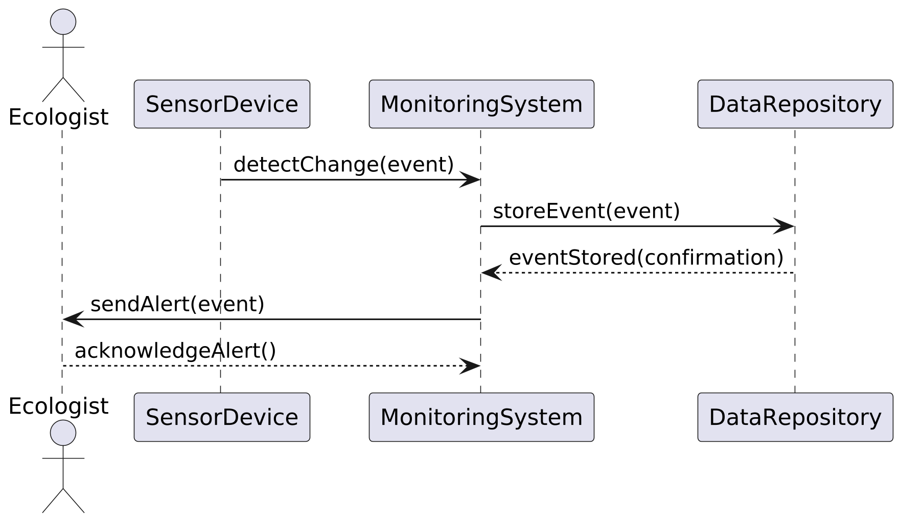</td>
      <td>
        <textarea readonly rows="10" style="width: 100%; height: 200px; font-family: monospace; font-size: 12px;">@startuml sequence_602_4_1
skinparam dpi 300
actor Ecologist
participant SensorDevice
participant MonitoringSystem
participant DataRepository

SensorDevice -> MonitoringSystem: detectChange(event)
MonitoringSystem -> DataRepository: storeEvent(event)
DataRepository --> MonitoringSystem: eventStored(confirmation)
MonitoringSystem -> Ecologist: sendAlert(event)
Ecologist --> MonitoringSystem: acknowledgeAlert()

@enduml</textarea>
      </td>
    </tr>
    <tr>
      <td>Mindmap FRL: Mermaid</td>
      <td>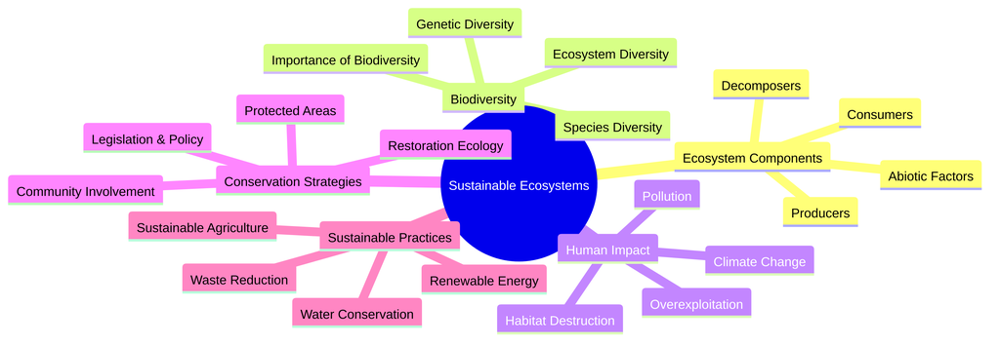</td>
      <td>
        <textarea readonly rows="12" style="width: 100%; height: 220px; font-family: monospace; font-size: 12px;">mindmap
  root((Sustainable Ecosystems))
    Ecosystem Components
      Producers
      Consumers
      Decomposers
      Abiotic Factors
    Biodiversity
      Genetic Diversity
      Species Diversity
      Ecosystem Diversity
      Importance of Biodiversity
    Human Impact
      Pollution
      Habitat Destruction
      Overexploitation
      Climate Change
    Conservation Strategies
      Protected Areas
      Restoration Ecology
      Legislation &amp; Policy
      Community Involvement
    Sustainable Practices
      Renewable Energy
      Sustainable Agriculture
      Waste Reduction
      Water Conservation</textarea>
      </td>
    </tr>
    <tr>
      <td>Component diagram FRL: PlantUML</td>
      <td>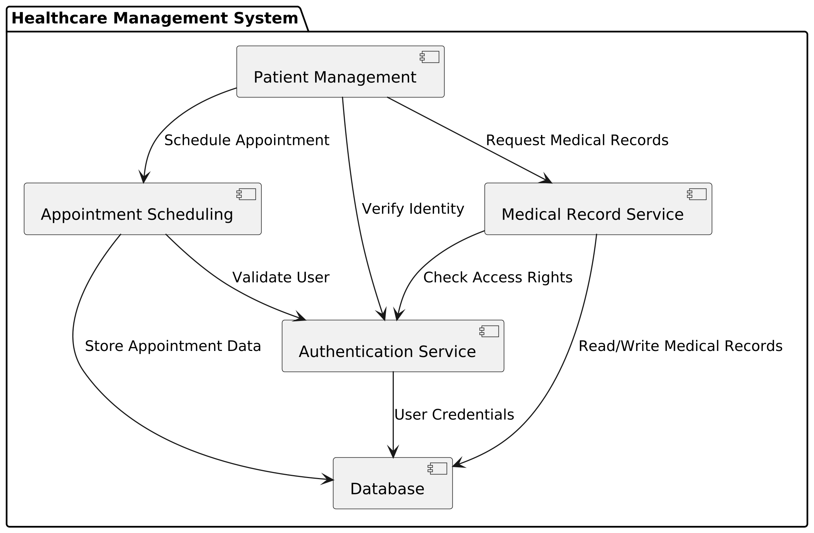</td>
      <td>
        <textarea readonly rows="12" style="width: 100%; height: 220px; font-family: monospace; font-size: 12px;">@startuml component_1823_4_1
skinparam dpi 300
package "Healthcare Management System" {
  [Patient Management] as PM
  [Appointment Scheduling] as AS
  [Authentication Service] as Auth
  [Medical Record Service] as MRS
  [Database] as DB

  PM --> Auth : "Verify Identity"
  PM --> MRS : "Request Medical Records"
  PM --> AS : "Schedule Appointment"

  AS --> Auth : "Validate User"
  AS --> DB : "Store Appointment Data"

  MRS --> Auth : "Check Access Rights"
  MRS --> DB : "Read/Write Medical Records"

  Auth --> DB : "User Credentials"
}
@enduml</textarea>
      </td>
    </tr>
    <tr>
      <td>State machine FRL: SCXML</td>
      <td>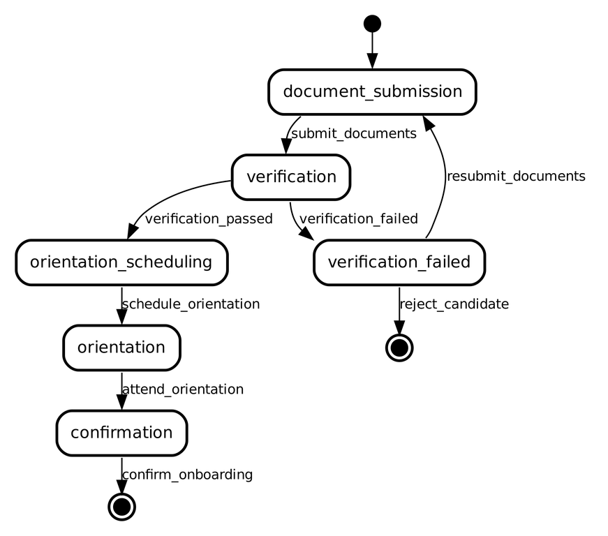</td>
      <td>
        <textarea readonly rows="10" style="width: 100%; height: 200px; font-family: monospace; font-size: 12px;"><?xml version="1.0" encoding="UTF-8"?>
<scxml xmlns="http://www.w3.org/2005/07/scxml" version="1.0" initial="document_submission">
  <state id="document_submission">
    <transition event="submit_documents" target="verification"/>
  </state>
  <state id="verification">
    <transition event="verification_passed" target="orientation_scheduling"/>
    <transition event="verification_failed" target="verification_failed"/>
  </state>
  <state id="verification_failed">
    <transition event="resubmit_documents" target="document_submission"/>
    <transition event="reject_candidate" target="rejected"/>
  </state>
  <state id="orientation_scheduling">
    <transition event="schedule_orientation" target="orientation"/>
  </state>
  <state id="orientation">
    <transition event="attend_orientation" target="confirmation"/>
  </state>
  <state id="confirmation">
    <transition event="confirm_onboarding" target="onboarded"/>
  </state>
  <final id="onboarded"/>
  <final id="rejected"/>
</scxml></textarea>
      </td>
    </tr>
    <tr>
      <td>Gantt chart FRL: Mermaid</td>
      <td>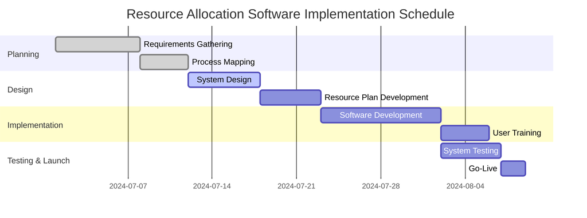</td>
      <td>
        <textarea readonly rows="10" style="width: 100%; height: 200px; font-family: monospace; font-size: 12px;">gantt
    title Resource Allocation Software Implementation Schedule
    dateFormat  YYYY-MM-DD
    section Planning
    Requirements Gathering      :done,    req, 2024-07-01, 7d
    Process Mapping             :done,    map, after req, 4d
    section Design
    System Design               :active,  des, after map, 6d
    Resource Plan Development   :         rpd, after des, 5d
    section Implementation
    Software Development        :         dev, after rpd, 10d
    User Training               :         train, after dev, 4d
    section Testing &amp; Launch
    System Testing              :         test, after dev, 5d
    Go-Live                     :         golive, after test, 2d</textarea>
      </td>
    </tr>
    <tr>
      <td>Knowledge graph FRL: RDF/Turtle (Graphviz)</td>
      <td>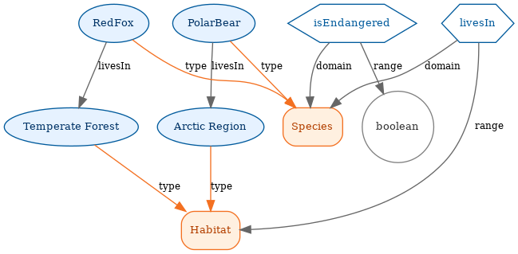</td>
      <td>
        <textarea readonly rows="10" style="width: 100%; height: 200px; font-family: monospace; font-size: 12px;">@prefix ex: &lt;http://example.org/ecology#&gt; .
@prefix rdf: &lt;http://www.w3.org/1999/02/22-rdf-syntax-ns#&gt; .
@prefix rdfs: &lt;http://www.w3.org/2000/01/rdf-schema#&gt; .

ex:Species a rdfs:Class .
ex:Habitat a rdfs:Class .
ex:livesIn a rdf:Property ;
    rdfs:domain ex:Species ;
    rdfs:range ex:Habitat .
ex:isEndangered a rdf:Property ;
    rdfs:domain ex:Species ;
    rdfs:range rdf:boolean .</textarea>
      </td>
    </tr>
    <tr>
      <td>Charting FRL: Plotly JSON</td>
      <td>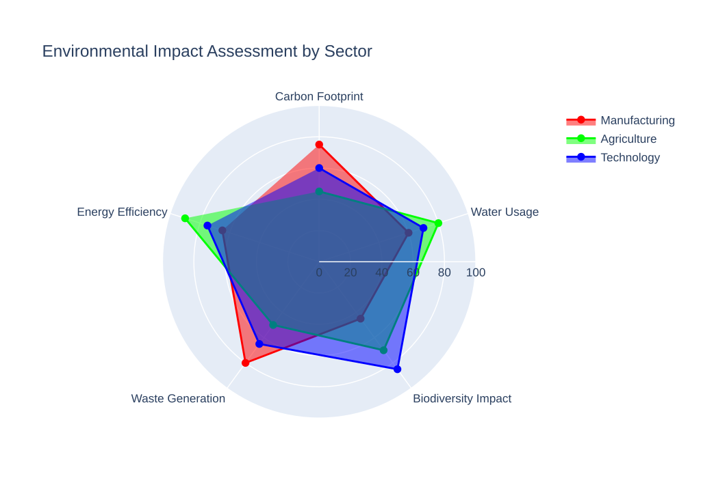</td>
      <td>
        <textarea readonly rows="10" style="width: 100%; height: 200px; font-family: monospace; font-size: 12px;">{
  "data": [
    {
      "type": "scatterpolar",
      "r": [
        75,
        60,
        45,
        80,
        65
      ],
      "theta": [
        "Carbon Footprint",
        "Water Usage",
        "Biodiversity Impact",
        "Waste Generation",
        "Energy Efficiency"
      ],
      "fill": "toself",
      "name": "Manufacturing",
      "line": {
        "color": "rgb(255, 0, 0)",
        "width": 2
      },
      "marker": {
        "size": 8
      }
    },
    {
      "type": "scatterpolar",
      "r": [
        45,
        80,
        70,
        50,
        90
      ],
      "theta": [
        "Carbon Footprint",
        "Water Usage",
        "Biodiversity Impact",
        "Waste Generation",
        "Energy Efficiency"
      ],
      "fill": "toself",
      "name": "Agriculture",
      "line": {
        "color": "rgb(0, 255, 0)",
        "width": 2
      },
      "marker": {
        "size": 8
      }
    },
    {
      "type": "scatterpolar",
      "r": [
        60,
        70,
        85,
        65,
        75
      ],
      "theta": [
        "Carbon Footprint",
        "Water Usage",
        "Biodiversity Impact",
        "Waste Generation",
        "Energy Efficiency"
      ],
      "fill": "toself",
      "name": "Technology",
      "line": {
        "color": "rgb(0, 0, 255)",
        "width": 2
      },
      "marker": {
        "size": 8
      }
    }
  ],
  "layout": {
    "polar": {
      "radialaxis": {
        "visible": true,
        "range": [
          0,
          100
        ],
        "tickmode": "linear",
        "tick0": 0,
        "dtick": 20
      },
      "angularaxis": {
        "direction": "clockwise",
        "period": 5
      }
    },
    "showlegend": true,
    "title": "Environmental Impact Assessment by Sector"
  }
}</textarea>
      </td>
    </tr>
    <tr>
      <td>Table chart FRL: Plotly JSON (Table)</td>
      <td>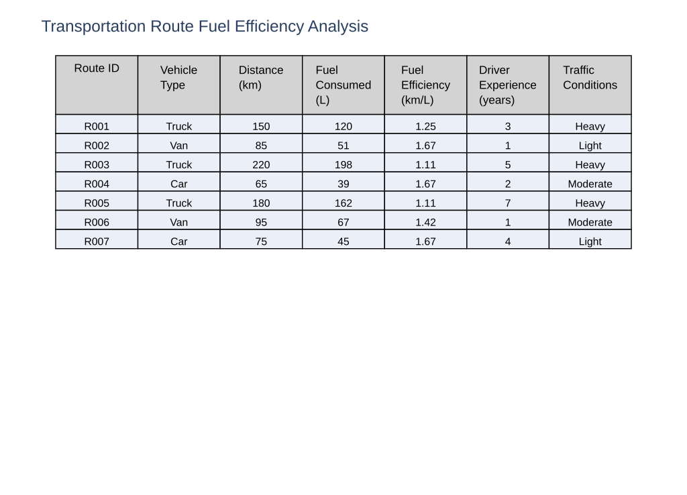</td>
      <td>
        <textarea readonly rows="12" style="width: 100%; height: 220px; font-family: monospace; font-size: 12px;">{
  "data": [
    {
      "type": "table",
      "header": {
        "values": [
          "Route ID",
          "Vehicle Type",
          "Distance (km)",
          "Fuel Consumed (L)",
          "Fuel Efficiency (km/L)",
          "Driver Experience (years)",
          "Traffic Conditions"
        ],
        "align": "center",
        "line": {
          "width": 1,
          "color": "black"
        },
        "fill": {
          "color": "lightgrey"
        },
        "font": {
          "family": "Arial",
          "size": 12,
          "color": "black"
        }
      },
      "cells": {
        "values": [
          [
            "R001",
            "R002",
            "R003",
            "R004",
            "R005",
            "R006",
            "R007"
          ],
          [
            "Truck",
            "Van",
            "Truck",
            "Car",
            "Truck",
            "Van",
            "Car"
          ],
          [
            150,
            85,
            220,
            65,
            180,
            95,
            75
          ],
          [
            120,
            51,
            198,
            39,
            162,
            67,
            45
          ],
          [
            1.25,
            1.67,
            1.11,
            1.67,
            1.11,
            1.42,
            1.67
          ],
          [
            3,
            1,
            5,
            2,
            7,
            1,
            4
          ],
          [
            "Heavy",
            "Light",
            "Heavy",
            "Moderate",
            "Heavy",
            "Moderate",
            "Light"
          ]
        ],
        "align": "center",
        "line": {
          "color": "black",
          "width": 1
        },
        "font": {
          "family": "Arial",
          "size": 11,
          "color": [
            "black"
          ]
        }
      }
    }
  ],
  "layout": {
    "title": {
      "text": "Transportation Route Fuel Efficiency Analysis"
    },
    "margin": {
      "l": 50,
      "r": 50,
      "b": 50,
      "t": 50
    }
  }
}</textarea>
      </td>
    </tr>
    <tr>
      <td>Neural network FRL: Keras JSON</td>
      <td>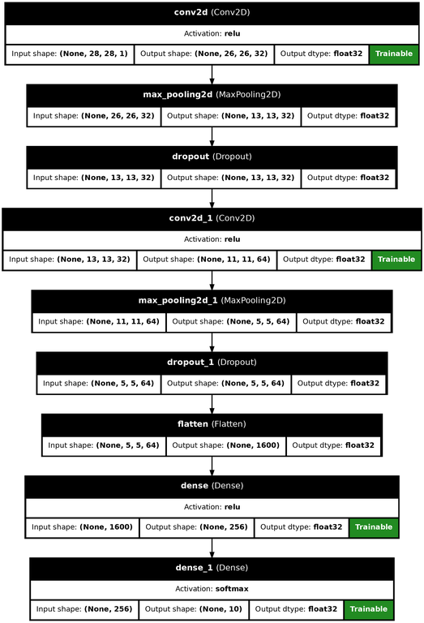</td>
      <td>
        <textarea readonly rows="12" style="width: 100%; height: 220px; font-family: monospace; font-size: 12px;">{
    "module": "keras.src",
    "class_name": "Sequential",
    "config": {
        "name": "sequential",
        "trainable": true,
        "dtype": {
            "module": "keras",
            "class_name": "DTypePolicy",
            "config": {
                "name": "float32"
            },
            "registered_name": null
        },
        "layers": [
            {
                "module": "keras.layers",
                "class_name": "InputLayer",
                "config": {
                    "batch_shape": [
                        null,
                        28,
                        28,
                        1
                    ],
                    "dtype": "float32",
                    "sparse": false,
                    "ragged": false,
                    "name": "input_layer"
                },
                "registered_name": null
            },
            {
                "module": "keras.layers",
                "class_name": "Conv2D",
                "config": {
                    "name": "conv2d",
                    "trainable": true,
                    "dtype": {
                        "module": "keras",
                        "class_name": "DTypePolicy",
                        "config": {
                            "name": "float32"
                        },
                        "registered_name": null
                    },
                    "filters": 32,
                    "kernel_size": [
                        3,
                        3
                    ],
                    "strides": [
                        1,
                        1
                    ],
                    "padding": "valid",
                    "data_format": "channels_last",
                    "dilation_rate": [
                        1,
                        1
                    ],
                    "groups": 1,
                    "activation": "relu",
                    "use_bias": true,
                    "kernel_initializer": {
                        "module": "keras.initializers",
                        "class_name": "GlorotUniform",
                        "config": {
                            "seed": null
                        },
                        "registered_name": null
                    },
                    "bias_initializer": {
                        "module": "keras.initializers",
                        "class_name": "Zeros",
                        "config": {},
                        "registered_name": null
                    },
                    "kernel_regularizer": null,
                    "bias_regularizer": null,
                    "activity_regularizer": null,
                    "kernel_constraint": null,
                    "bias_constraint": null
                },
                "registered_name": null,
                "build_config": {
                    "input_shape": [
                        null,
                        28,
                        28,
                        1
                    ]
                }
            },
            {
                "module": "keras.layers",
                "class_name": "MaxPooling2D",
                "config": {
                    "name": "max_pooling2d",
                    "trainable": true,
                    "dtype": {
                        "module": "keras",
                        "class_name": "DTypePolicy",
                        "config": {
                            "name": "float32"
                        },
                        "registered_name": null
                    },
                    "pool_size": [
                        2,
                        2
                    ],
                    "padding": "valid",
                    "strides": [
                        2,
                        2
                    ],
                    "data_format": "channels_last"
                },
                "registered_name": null
            },
            {
                "module": "keras.layers",
                "class_name": "Dropout",
                "config": {
                    "name": "dropout",
                    "trainable": true,
                    "dtype": {
                        "module": "keras",
                        "class_name": "DTypePolicy",
                        "config": {
                            "name": "float32"
                        },
                        "registered_name": null
                    },
                    "rate": 0.25,
                    "seed": null,
                    "noise_shape": null
                },
                "registered_name": null
            },
            {
                "module": "keras.layers",
                "class_name": "Conv2D",
                "config": {
                    "name": "conv2d_1",
                    "trainable": true,
                    "dtype": {
                        "module": "keras",
                        "class_name": "DTypePolicy",
                        "config": {
                            "name": "float32"
                        },
                        "registered_name": null
                    },
                    "filters": 64,
                    "kernel_size": [
                        3,
                        3
                    ],
                    "strides": [
                        1,
                        1
                    ],
                    "padding": "valid",
                    "data_format": "channels_last",
                    "dilation_rate": [
                        1,
                        1
                    ],
                    "groups": 1,
                    "activation": "relu",
                    "use_bias": true,
                    "kernel_initializer": {
                        "module": "keras.initializers",
                        "class_name": "GlorotUniform",
                        "config": {
                            "seed": null
                        },
                        "registered_name": null
                    },
                    "bias_initializer": {
                        "module": "keras.initializers",
                        "class_name": "Zeros",
                        "config": {},
                        "registered_name": null
                    },
                    "kernel_regularizer": null,
                    "bias_regularizer": null,
                    "activity_regularizer": null,
                    "kernel_constraint": null,
                    "bias_constraint": null
                },
                "registered_name": null,
                "build_config": {
                    "input_shape": [
                        null,
                        13,
                        13,
                        32
                    ]
                }
            },
            {
                "module": "keras.layers",
                "class_name": "MaxPooling2D",
                "config": {
                    "name": "max_pooling2d_1",
                    "trainable": true,
                    "dtype": {
                        "module": "keras",
                        "class_name": "DTypePolicy",
                        "config": {
                            "name": "float32"
                        },
                        "registered_name": null
                    },
                    "pool_size": [
                        2,
                        2
                    ],
                    "padding": "valid",
                    "strides": [
                        2,
                        2
                    ],
                    "data_format": "channels_last"
                },
                "registered_name": null
            },
            {
                "module": "keras.layers",
                "class_name": "Dropout",
                "config": {
                    "name": "dropout_1",
                    "trainable": true,
                    "dtype": {
                        "module": "keras",
                        "class_name": "DTypePolicy",
                        "config": {
                            "name": "float32"
                        },
                        "registered_name": null
                    },
                    "rate": 0.25,
                    "seed": null,
                    "noise_shape": null
                },
                "registered_name": null
            },
            {
                "module": "keras.layers",
                "class_name": "Flatten",
                "config": {
                    "name": "flatten",
                    "trainable": true,
                    "dtype": {
                        "module": "keras",
                        "class_name": "DTypePolicy",
                        "config": {
                            "name": "float32"
                        },
                        "registered_name": null
                    },
                    "data_format": "channels_last"
                },
                "registered_name": null,
                "build_config": {
                    "input_shape": [
                        null,
                        5,
                        5,
                        64
                    ]
                }
            },
            {
                "module": "keras.layers",
                "class_name": "Dense",
                "config": {
                    "name": "dense",
                    "trainable": true,
                    "dtype": {
                        "module": "keras",
                        "class_name": "DTypePolicy",
                        "config": {
                            "name": "float32"
                        },
                        "registered_name": null
                    },
                    "units": 256,
                    "activation": "relu",
                    "use_bias": true,
                    "kernel_initializer": {
                        "module": "keras.initializers",
                        "class_name": "GlorotUniform",
                        "config": {
                            "seed": null
                        },
                        "registered_name": null
                    },
                    "bias_initializer": {
                        "module": "keras.initializers",
                        "class_name": "Zeros",
                        "config": {},
                        "registered_name": null
                    },
                    "kernel_regularizer": null,
                    "bias_regularizer": null,
                    "kernel_constraint": null,
                    "bias_constraint": null
                },
                "registered_name": null,
                "build_config": {
                    "input_shape": [
                        null,
                        1600
                    ]
                }
            },
            {
                "module": "keras.layers",
                "class_name": "Dense",
                "config": {
                    "name": "dense_1",
                    "trainable": true,
                    "dtype": {
                        "module": "keras",
                        "class_name": "DTypePolicy",
                        "config": {
                            "name": "float32"
                        },
                        "registered_name": null
                    },
                    "units": 10,
                    "activation": "softmax",
                    "use_bias": true,
                    "kernel_initializer": {
                        "module": "keras.initializers",
                        "class_name": "GlorotUniform",
                        "config": {
                            "seed": null
                        },
                        "registered_name": null
                    },
                    "bias_initializer": {
                        "module": "keras.initializers",
                        "class_name": "Zeros",
                        "config": {},
                        "registered_name": null
                    },
                    "kernel_regularizer": null,
                    "bias_regularizer": null,
                    "kernel_constraint": null,
                    "bias_constraint": null
                },
                "registered_name": null,
                "build_config": {
                    "input_shape": [
                        null,
                        256
                    ]
                }
            }
        ],
        "build_input_shape": [
            null,
            28,
            28,
            1
        ]
    },
    "registered_name": null,
    "build_config": {
        "input_shape": [
            null,
            28,
            28,
            1
        ]
    }
}</textarea>
      </td>
    </tr>
    <tr>
      <td>Geospatial polygon FRL: GeoJSON (GeoPandas)</td>
      <td>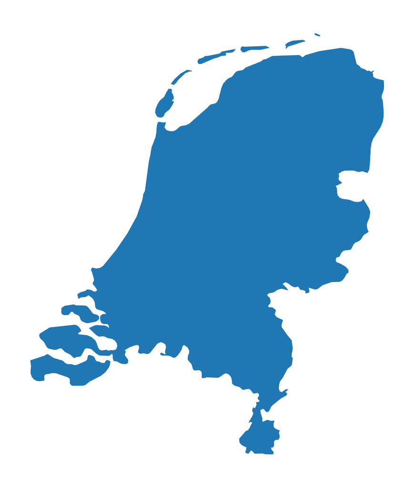</td>
      <td>
        <textarea readonly rows="10" style="width: 100%; height: 200px; font-family: monospace; font-size: 12px;">{ "type": "MultiPolygon", "coordinates": [ [ [ [ 7.194591, 53.245022 ], 
[ 7.197472, 53.216624 ], 
[ 7.198506, 53.200578 ], 
[ 7.195405, 53.184998 ], 
[ 7.188584, 53.167789 ], 
[ 7.174425, 53.145775 ], 
[ 7.171944, 53.137714 ], 
[ 7.172668, 53.125751 ], 
[ 7.176492, 53.119394 ], 
[ 7.181349, 53.114175 ], 
[ 7.18507, 53.105442 ], 
[ 7.194372, 53.033844 ], 
[ 7.192821, 52.998006 ], 
[ 7.183623, 52.966122 ], 
[ 7.161919, 52.932636 ], 
[ 7.079857, 52.854424 ], 
[ 7.072151, 52.841317 ], 
[ 7.061977, 52.824012 ], 
[ 7.053295, 52.790577 ], 
[ 7.043993, 52.682625 ] ] ] ] }
...</textarea>

      </td>
    </tr>
  </tbody>
</table>
